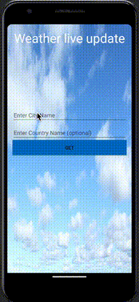

# WeatherApp_Android_Studio
Weather application made in Android Studio, Volley Library, and OpenWeatherMap Api

Here is a gif of how the app works. 

You type in city name and get the current weather updates of the city. 

You may or may not type in the country name. 

